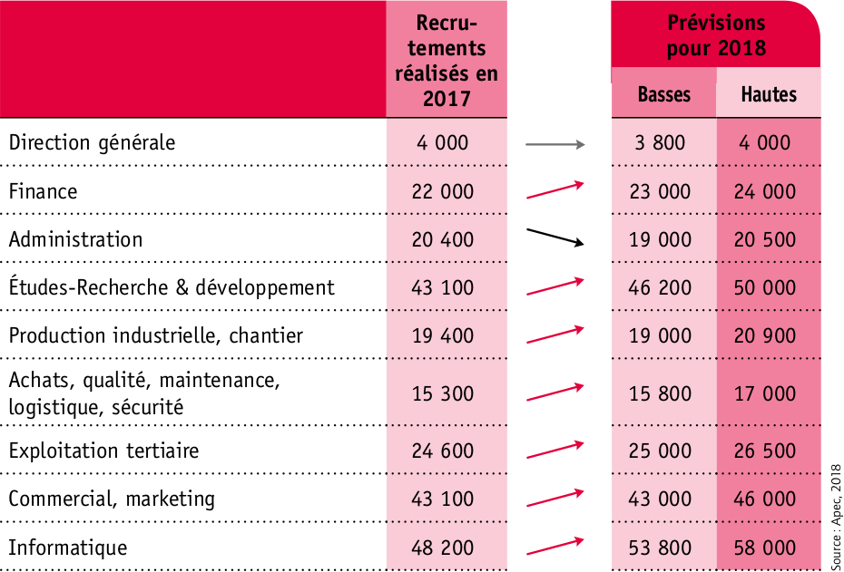
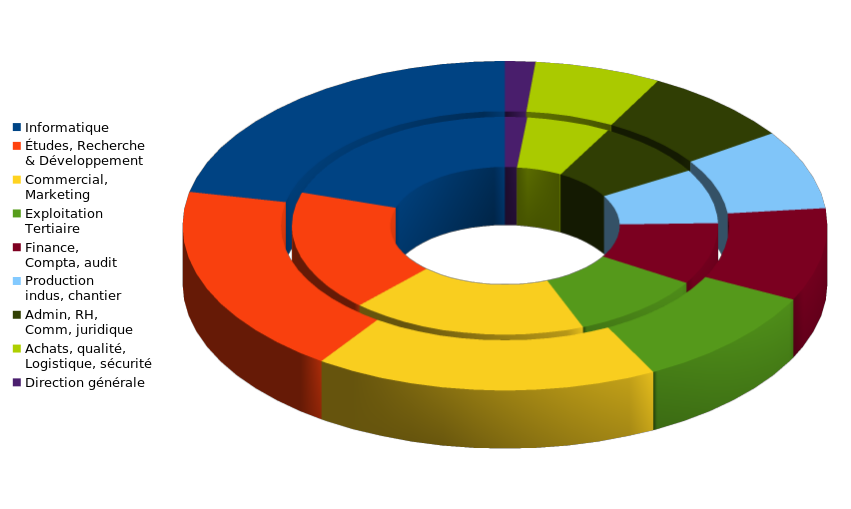
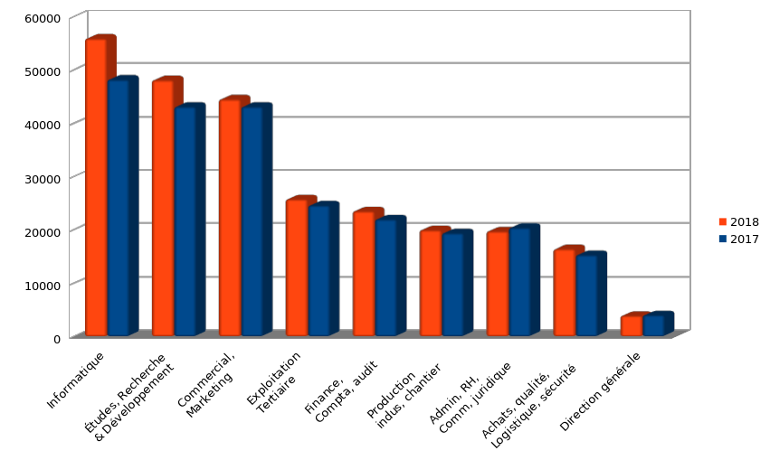

Emploi cadre
============

Énoncé
------

* :download:`Document <apec.pdf>`

Chiffres
--------

+-----------------------------------------------------+----------+---------+----------------------+
|                                                     |          |   | ↗   |   prévisions  2018   |
| | Recrutements cadres en CDI et CDD ≥ 1 an          |   2017   |   | %   +----------+-----------+
| | dans le secteur privé en France métropolitaine    |          |   | ↘   | moyennes | | hautes  |
|                                                     |          |         |          | | basses  |
+-----------------------------------------------------+----------+---------+----------+-----------+
| Informatique                                        | | 48 200 | | ↗ 16  | | 55 900 | | 58 000  |
|                                                     | | 20,0 % | | ↗ 1,7 | | 21,7 % | | 53 800  |
+-----------------------------------------------------+----------+---------+----------+-----------+
| | Études,                                           | | 43 100 | | ↗ 12  | | 48 100 | | 50 000  |
| | Recherche & Développement                         | | 18,0 % | | ↗ 0,7 | | 18,7 % | | 46 200  |
+-----------------------------------------------------+----------+---------+----------+-----------+
| Commercial, marketing                               | | 43 100 | | ↗ 3,3 | | 44 500 | | 46 000  |
|                                                     | | 18,0 % | | ↘ 0,7 | | 17,3 % | | 43 000  |
+-----------------------------------------------------+----------+---------+----------+-----------+
| | Tertiaire : banque, assurance, immobilier, santé, | | 24 600 | | ↗ 4,7 | | 25 750 | | 26 500  |
| | action sociale, formation, tourisme, transports   | | 10,2 % | | ↘ 0,2 | | 10,0 % | | 25 000  |
+-----------------------------------------------------+----------+---------+----------+-----------+
| Finance, comptabilité, audit                        | | 22 000 | | ↗ 6,8 | | 23 500 | | 24 000  |
|                                                     | | 09,2 % | | ↘ 0,2 | | 09,0 % | | 23 000  |
+-----------------------------------------------------+----------+---------+----------+-----------+
| | Production industrielle,                          | | 19 400 | | ↗ 2,8 | | 19 950 | | 20 900  |
| | chantier                                          | | 08,0 % | | ↘ 0,3 | | 07,7 % | | 19 000  |
+-----------------------------------------------------+----------+---------+----------+-----------+
| | Administration, RH,                               | | 20 400 | | ↘ 3,2 | | 19 750 | | 20 500  |
| | communication, juridique                          | | 08,5 % | | ↘ 0,8 | | 07,7 % | | 19 000  |
+-----------------------------------------------------+----------+---------+----------+-----------+
| | Achats, qualité, maintenance,                     | | 15 300 | | ↗ 7,2 | | 16 400 | | 17 000  |
| | logistique, sécurité                              | | 06,4 % | | → 0,0 | | 06,4 % | | 15 800  |
+-----------------------------------------------------+----------+---------+----------+-----------+
| Direction générale                                  | | 4 000  | | ↘ 2,5 | | 3 900  | | 4 000   |
|                                                     | | 01,7 % | | ↘ 0,2 | | 01,5 % | | 3 800   |
+-----------------------------------------------------+----------+---------+----------+-----------+
| Totaux                                              |  240 100 |   ↗ 7,4 |  257 750 | | 266 900 |
|                                                     |          |         |          | | 248 600 |
+-----------------------------------------------------+----------+---------+----------+-----------+

* :download:`Croissances <croissances.png>`

Graphiques
----------

* :download:`Tableur <cadres.ods>`

Document
--------

.. literalinclude:: cadres.tex
   :language: LaTeX
