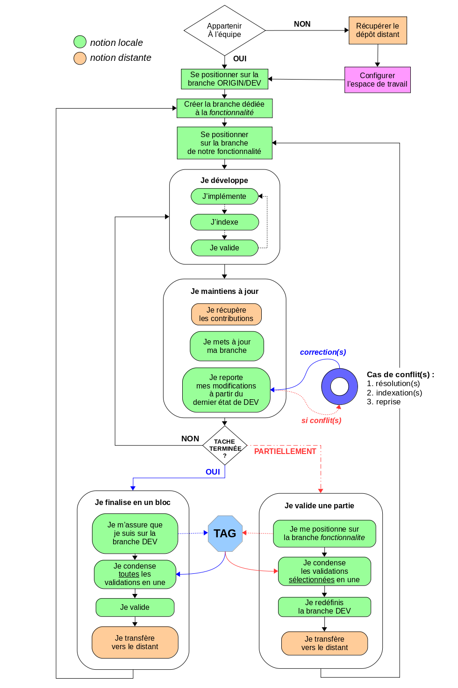
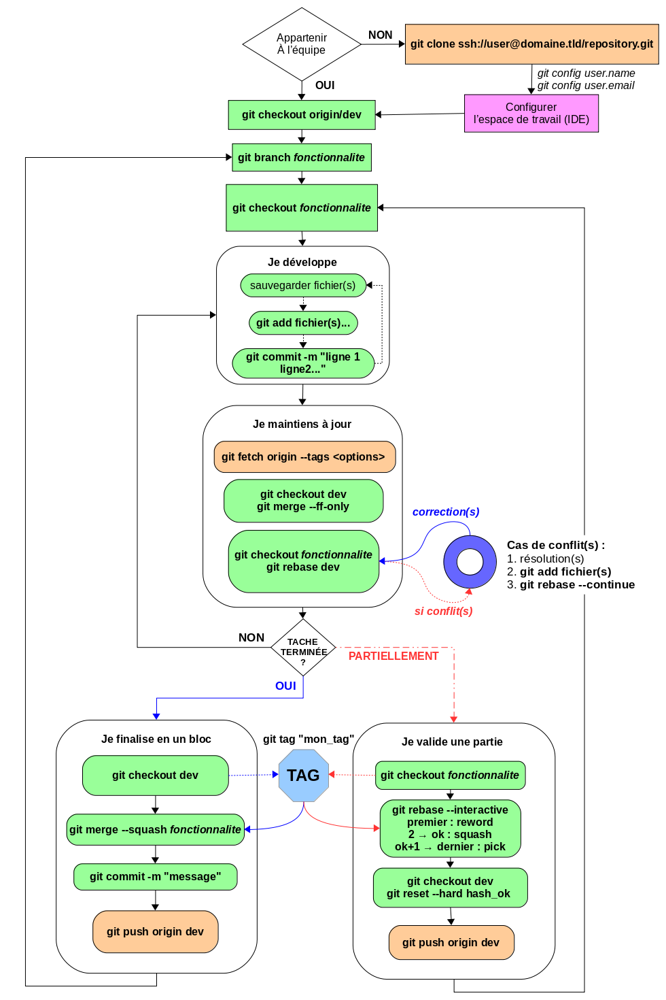

Image
=====

Identification
==============

Titre
-----

« Travailler en équipe avec Git ».

Nature de l’image
-----------------

Logigramme.

Image unique / série d’images
-----------------------------

| Cette image est la première d’un couple.
| La deuxième présente une :ref:`version technique du même logigramme <technique>`.

Méthode d’obtention
-------------------

Construction et rendu PNG réalisés avec LibreOffice.

Échelle
-------

L’image occupe une pleine page A4 orientée portrait.

Taux d’agrandissement
---------------------

Automatique par rapport aux tailles d’impression et de rendu.

Source : réalisation, auteur, publication, site
-----------------------------------------------

| Réalisation issue de ma collaboration avec Benjamin FERRAN,
| dans le cadre d’une étude pour des formations au logiciel Git.

Interprétation
==============

Lisibilité
----------

L’image :

* occupe tout l’espace disponible
* espace ses différentes parties
* évite la surcharge des sous-parties

Couleurs signifiantes, contrastées
----------------------------------

Les couleurs :

* sont limitées à 5, en dehors des noir et blanc
* sont tranchées les unes par rapport aux autres
* ressortent visuellement bien à l’impression
* correspondent à des thématiques différentes

Identification des axes
-----------------------

Deux axes sont présents :

* le temps s’écoule au fil des actions, verticalement et de haut en bas
* les actions alternatives, horizontalement et de gauche à droite

Définition des symboles
-----------------------

Par ordre d’apparition :

* les losanges interrogent l’espace de travail
* les flèches indiquent la prochaine action à effectuer
* les rectangles représentent des actions atomiques
* les rectangles arrondis structurent les parties et sous-parties
* les pointillés indiquent une situation facultative ou exceptionnelle
* le cercle matérialise un processus pouvant se répéter beaucoup
* l’octogone montre une étape optionnelle commune d’étiquettage

Légendes
--------

L’unique légende, en haut à gauche, définit 2 notions :

* vert → locale : seul le poste de travail est concerné
* orange → distante : une machine du réseau est impliquée

Commentaire
-----------

| L’image tente de schématiser, en le simplifiant le plus possible,
| tout le processus de travail d’un développeur logiciel avec Git.

Image scientifique ?
--------------------

L’image s’inscrit dans une démarche rationnelle :

* énumération des différents cas d’utilisation possibles
* décomposition des cas d’utilisation en actions atomiques
* identifications des différentes situations alternatives
* réalisation d’un graphe débouchant sur un logigramme
* agencement du logigramme pour occuper au mieux l’espace

Appropriation critique
======================

Idée principale apportée, valeur informative
--------------------------------------------

| Avoir une vue d’ensemble de tout le processus de développement,
| pour ne jamais se sentir perdu en ne sâchant plus quoi faire.

Rôle : observation, visibilité, découverte, résultat
----------------------------------------------------

| Découverte du fonctionnement global de l’outil, en conclusion
| d’une étude en présentant tous les tenants et aboutissants.

Image séduisante, émouvante ?
-----------------------------

| Le couple d’images, conçu pour une impression au format A4,
| a séduit au moins une partie des collègues de travail,
| ces derniers l’ayant affiché sur tableau, meuble ou mur.

Compréhensions / incompréhensions, lisibilité
---------------------------------------------

La lisibilité découle de la séparation en 2 images :

* la première assure une compréhension fonctionnelle en français
* seule la deuxième peut engendrer des incompréhensions techniques

Image inédite ?
---------------

| Avant de réaliser ce double logigramme, mon collègue et moi-même
| n’avons pas trouvé de schéma existant synthétisant autant le processus.

Autres images possibles
-----------------------

Nous avons fait le choix d’aller au plus synthétique possible.
Il y aurait donc de nombreuses possibilités d’images différentes :

* agencement spatial différent pour un support plus étendu
* symbologie plus exhaustive par types d’actions
* représentation de l’état de fichiers au fil des actions
* décomposition de certaines sous-parties en un autre niveau
* etc.

.. _technique:

Image technique associée
========================

